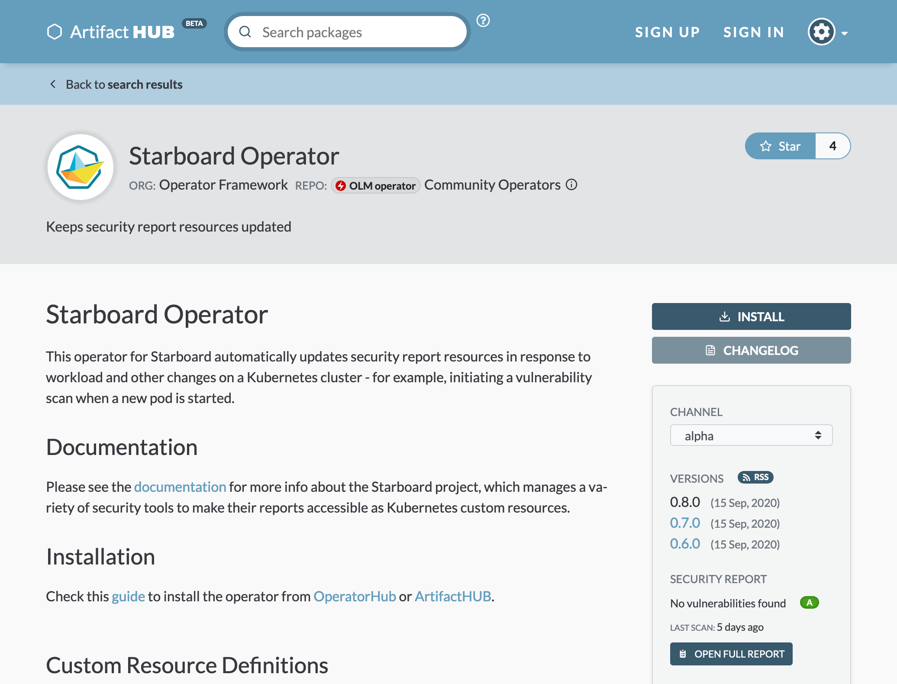
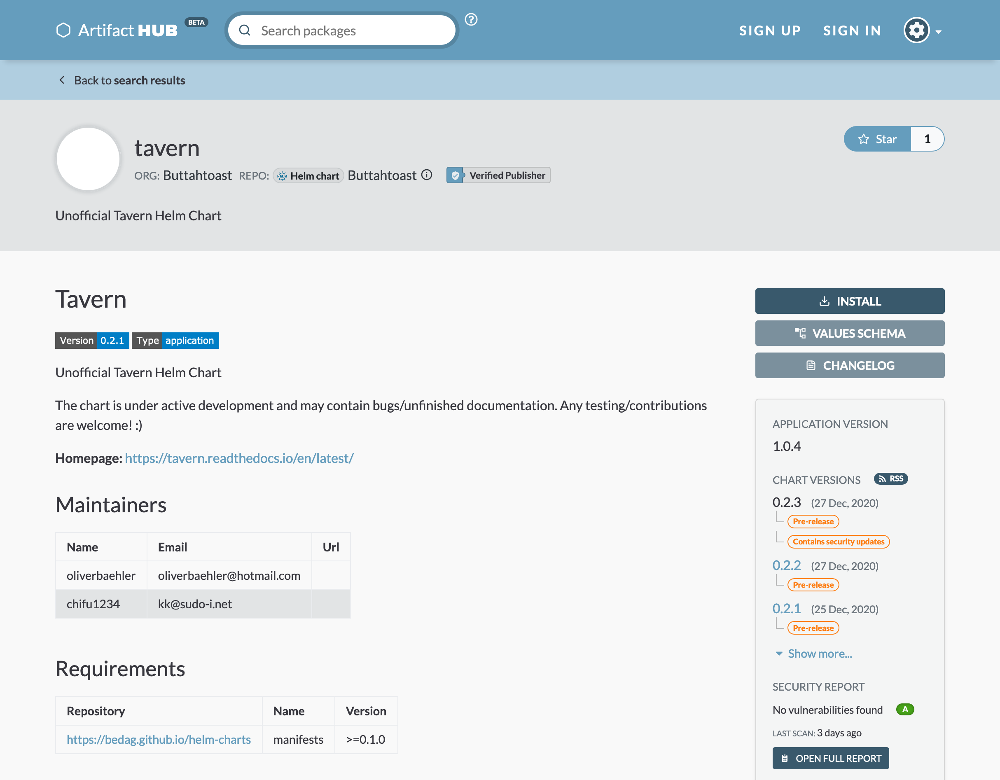

When trying to make a decision about which artifacts to use it's useful to know some information about the security of the artifact. With Artifact Hub, it's possible to see security scans for container based artifacts such as Operator Framework OLM based operators, some Helm Charts, OPA Policies, and Tinkerbell actions.<!--more-->

## OLM Operators

When an operator contains an image that can be scanned a grade, the last time the image was scanned, and access to the full report can be found in the sidebar. The image below for the [Starboard Operator](https://artifacthub.io/packages/olm/community-operators/starboard-operator), provided by the community operators, illustrates a report without vulnerabilities.



_Note: SCRATCH images, such as those that have no underlying layers and only contain a binary, and images with the `latest` tag being used are not scanned._

## Helm Charts

With Helm charts it is possible to opt-in to having the images scanned and a report provided just like OLM based operators. The [tavern](https://artifacthub.io/packages/helm/buttahtoast/tavern) chart, seen below, provides an example that illustrates a report with no vulnerabilities. Like the OLM operators, it shows a grade, when the last scan was performed, and the ability to see the full report.



Helm charts do not provide an easy way to obtain all of the images that could possibly be used in a chart. It's not possible to know how to render all charts in all possible configurations to detect the images within them. To enable Artifact Hub to discover the images a chart author needs to list them in annotations within the _Chart.yaml_ file for the chart. The following example shows the format:

```yaml
annotations:
  artifacthub.io/images: |
    - name: img1
      image: repo/img1:1.0.0
    - name: img2
      image: repo/img2:2.0.0
```

You can learn more about listing images in the [Helm supported annotations documentation](https://artifacthub.io/docs/topics/annotations/helm/#supported-annotations).

## How It Works

The security report is generated using [Trivy](https://github.com/aquasecurity/trivy) and periodic scans. The scanner checks images that have not been scanned. Images that were last scanned 7 days ago are re-scanned even when there was no change to a package. This will enable the detection of newly discovered CVEs to be shown in the report.

Some images cannot be scanned, such as those with binaries in a scratch container or those tagged with `latest`. In those cases a report will not be shown.

You can [learn more about the security report in the documentation](https://artifacthub.io/docs/topics/security_report/).