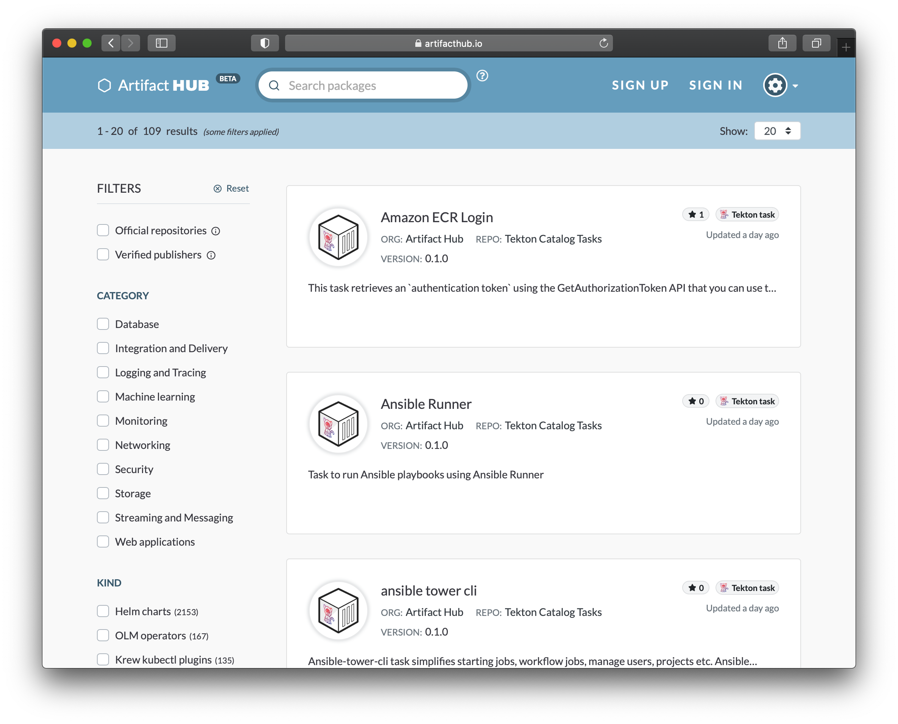

Artifact Hub has already provided search and discovery for Helm charts, OLM based operators, Falco rules, OPA policies, Tinkerbell actions, Krew (kubectl) plugins, and Helm plugins. These are all [CNCF](https://www.cncf.io/) project related artifacts. We are happy to share that we have expanded beyond the CNCF to support another non-profit foundation based project with support for [Tekton](https://tekton.dev/) tasks.<!--more-->

Tekton is, in the words of their website:

> Tekton is a powerful and flexible open-source framework for creating CI/CD systems, allowing developers to build, test, and deploy across cloud providers and on-premise systems.

You can [browse the existing Tekton tasks](https://artifacthub.io/packages/search?page=1&kind=7) (as shown below) and even [get your own tasks listed](https://artifacthub.io/docs/topics/repositories/#tekton-tasks-repositories).

Tekton is a [cd.foundation](https://cd.foundation/) project. The cd.foundation is another Linux Foundation sub-foundation alongside the CNCF.