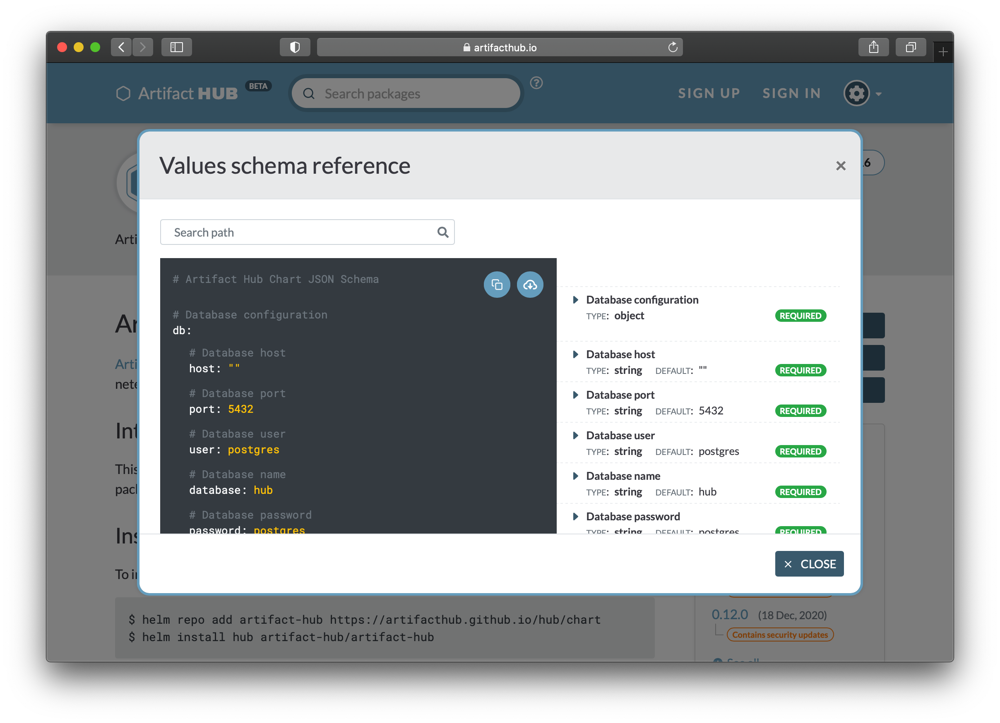

Helm v3 introduced [schemas for values](https://helm.sh/docs/topics/charts/#schema-files). The schemas are written as JSON Schemas and put in a chart in a file named `values.schema.json` that goes right alongside `values.yaml` files. Wouldn't it be great if there was a way to easily use these files to understand the values in a chart? Artifact Hub provides just that with its Values Schema Reference.<!--more-->

This image is the [Values Schema Reference for the chart that installs the Artifact Hub](https://artifacthub.io/packages/helm/artifact-hub/artifact-hub?modal=values-schema) software.

On the left is YAML for the values, on the right is the information from the schema lined up with the YAML on the left, and at the top is a search box with autocomplete.

Using this information you can learn more about any chart that provides a schema. Accessing the Values Schema Reference happens through a button in the right sidebar, when a schema is available for a chart.