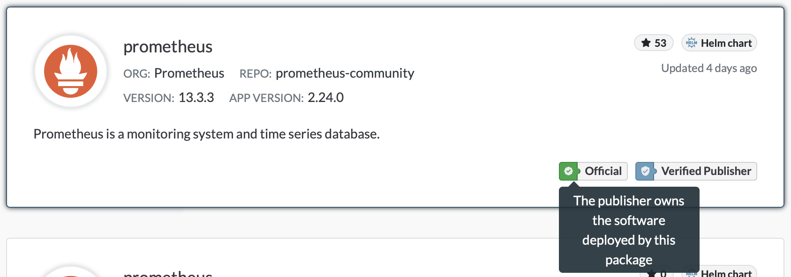

Ever wonder if you are getting a package for a piece of software from the developer of that software? Or, have you ever wondered if the person who listed a repository or package on the Artifact Hub owns it? If you have, than you're in luck. The Artifact Hub has badges that can answer those questions for you.<!--more-->

## Verified Publishers

To illustrate this we can look at the prometheus chart as it is found in search.

In the lower right corner you'll notice a badge notifying that it's a verified publisher. When you mouse over the badge it explains that a verified publisher owns a repository.

The [process to prove ownership and become a verified publisher is located in the Artifact Hub documentation](https://artifacthub.io/docs/topics/repositories/#verified-publisher). The gist behind it is that you need to upload a file to the repository with information signifying ownership.

## Official Status

Official status is for repositories and packages that ship software they also develop. Prometheus coming from the Prometheus project is an example of something that can get official status while Bitnami packaging and delivering software like WordPress is not. This isn't to say that packages from unofficial organizations can't be excellent and trustworthy. Official status is designed to help those searching for software to be able to identify packages from software developers, if they exist.

The above prometheus chart example shows an official badge. When you mouse over the badge it provides some more detail about official status.

Gaining official status is more involved than having a verified repository. There are a number of requirements that need to be met including becoming a verified repository. Once the requirements are met a request needs to be submitted and someone will evaluate the setup to ensure it meets the criteria. All of this is [covered in the documentation](https://artifacthub.io/docs/topics/repositories/#official-status).
