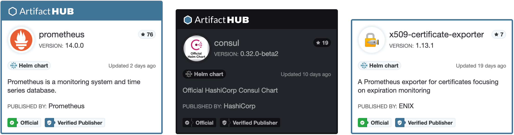

Ever want to show off a package from the Artifact Hub on a website? I know I've thought about putting one in the sidebar of a website. Artifact Hub now makes that easy with a widget you can embed. The above image displays various configurations of the widget you can get from Artifact Hub.<!--more-->

Getting a widget for any packages is straight forward. When viewing a package there is a menu with three dots. Under there is an option to get the widget. The Prometheus example below shows you where the option is.

A modal, like the one below, will pop-up with options you can use to configure the display of the widget.



Now you can easily show off you charts, plugins, operators, actions, and more.
