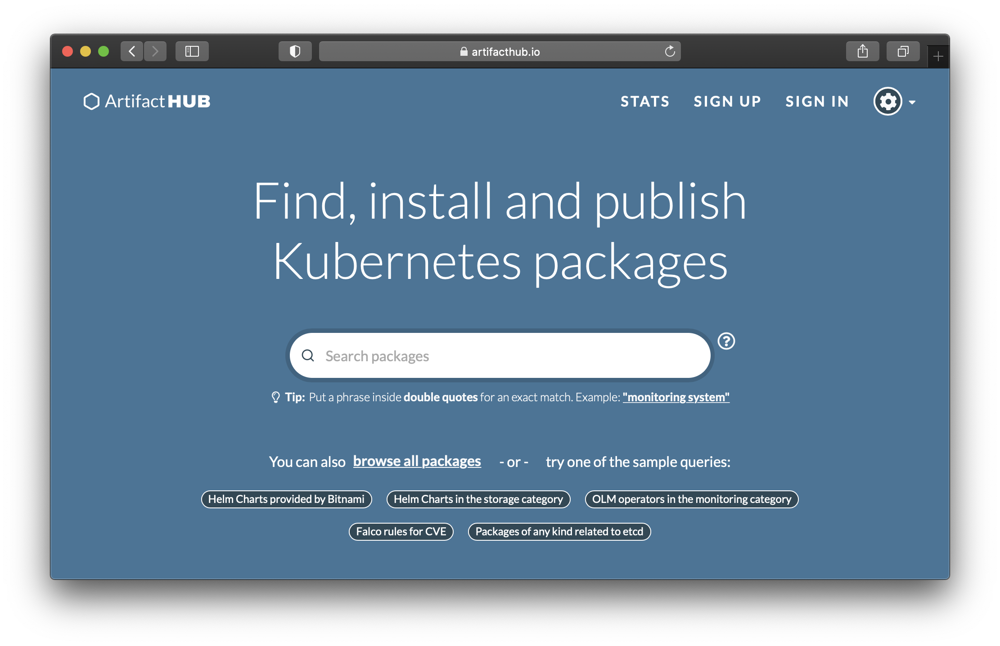
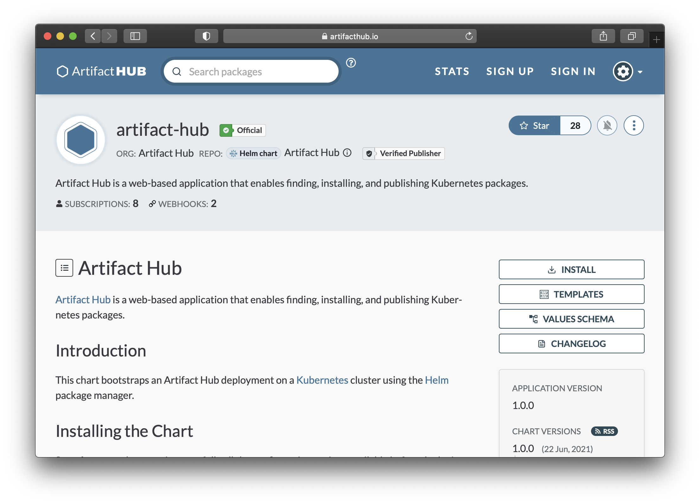

We're happy to announce the release of [Artifact Hub 1.0.0](https://github.com/artifacthub/hub/releases/tag/v1.0.0).

Artifact Hub is more than a website where you can search for cloud native packages. The software that powers the Artifact Hub is open source and can be run by anyone.<!--more-->

The [Artifact Hub website has a listing for the Artifact Hub software](https://artifacthub.io/packages/helm/artifact-hub/artifact-hub) with directions on how you can install it. The Artifact Hub listing on the Artifact Hub also services as an example of what a listing can display.

If you need a software to display your Helm charts, operators, or one of the other many things the Artifact Hub supports you can now use a stable release of the Artifact Hub to do so.
