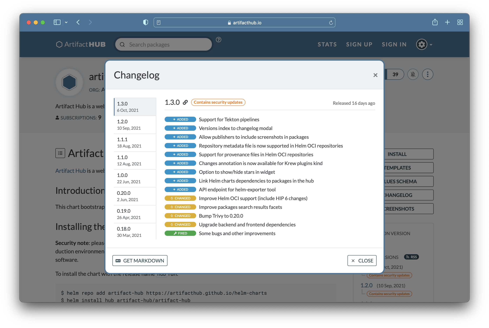

[Changelogs](https://en.wikipedia.org/wiki/Changelog) are useful for consumers of an artifact or package. They let consumers see, at a glance, what has changed without needing to read or understand the source. Reading the source doesn't convey intent as well as a changelog, either. To understand intent, you often need to look at issues and commit messages for some additional context. All of that can be summarized in a changelog.<!--more-->

Artifact Hub provides the ability to have a changelog that can be nicely displayed, easily navigated, and downloaded as markdown. The image displayed here is the changelog for the Artifact Hub chart. Changelogs are supported for most of the supported artifact types. Artifact Hub discovers them via annotations.

The annotation works in two different forms. To illustrate these we can look at the Artifact Hub chart. First, there is a simple form that looks like:

```yaml
annotations:
  artifacthub.io/changes: |
    - Support for Tekton pipelines
    - Versions index to changelog modal
    - Allow publishers to include screenshots in packages
```

The simple form is just a list of the things that have changed.

A more complex form enables you to mark things as added, changed, and fixed while providing the ability to add links to relevant sources. That form looks like:

```yaml
annotations:
  artifacthub.io/changes: |
    - kind: added
      description: Support for Tekton pipelines
      links:
          - name: Github Issue
            url: https://github.com/artifacthub/hub/issues/1485
    - kind: added
      description: Versions index to changelog modal
    - kind: added
      description: Allow publishers to include screenshots in packages
```

In this example you'll notice the links are optional. When more information is added for the changes, Artifact Hub can provide a richer display.

The changes only need to include those for the current version. Artifact Hub builds the multi-release changelog from changes for each version. This full list is then displayed when clicking the changelog button on an artifact and can be downloaded as markdown from this display like the following:

```yaml
# Changelog

## 1.3.0 - 2021-10-06

### Added

- Support for Tekton pipelines
- Versions index to changelog modal
- Allow publishers to include screenshots in packages
- Repository metadata file is now supported in Helm OCI repositories
- Support for provenance files in Helm OCI repositories
- Changes annotation is now available for Krew plugins kind
...
```

The details you need to apply this to your artifacts can be found in the [Artifact Hub annotation documentation](https://artifacthub.io/docs/).
