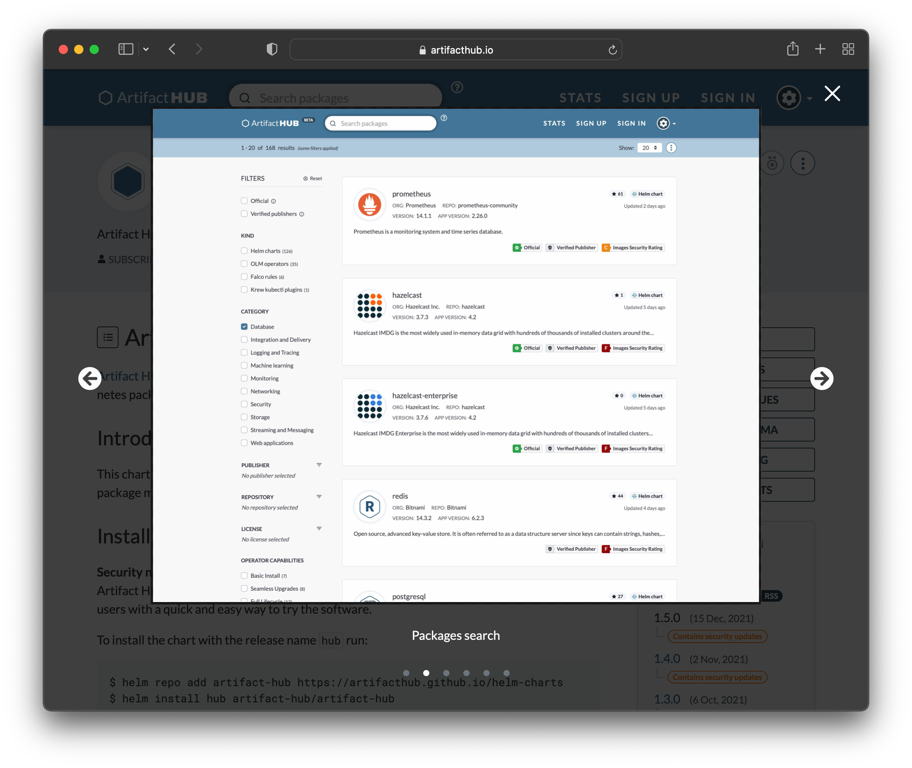
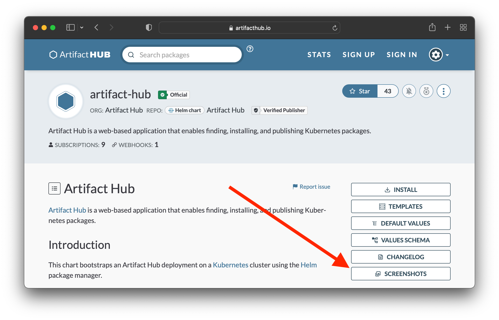

Does your application have a user interface? Would you want to display screenshots of it? If that's the case, you can display them on Artifact Hub for Helm, OLM, Krew, and Tekton. The screenshot below shows the display screenshots for the [Artifact Hub chart](https://artifacthub.io/packages/helm/artifact-hub/artifact-hub).

When screenshots are made available to Artifact Hub a button will display in the sidebar to access them.<!--more--> The next screenshot illustrates where you can find the button.

If you want to add screenshots to your artifacts you can use the `artifacthub.io/screenshots` annotation. The details of this annotation, along with examples, can be found in the [Artifact Hub documentation](https://artifacthub.io/docs).