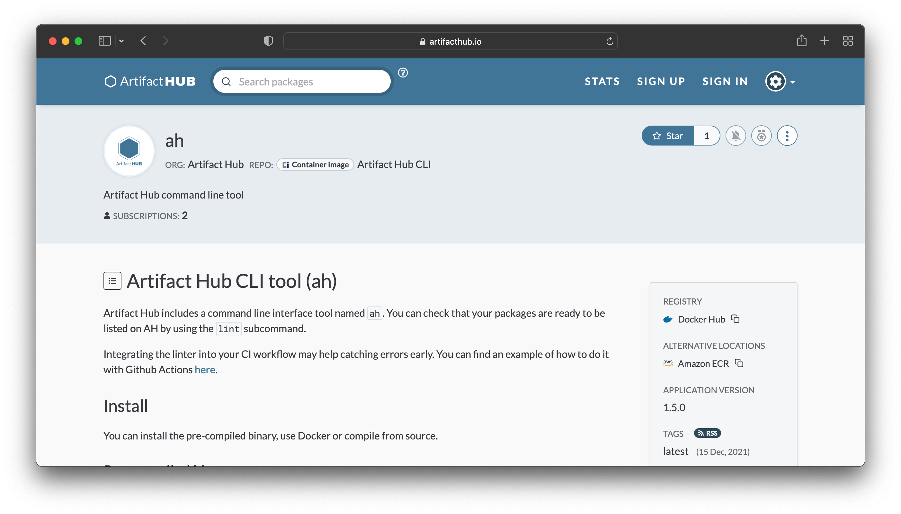

When containers took off in popularity, everyone was putting their container images meant for general public consumption on [Docker Hub](https://hub.docker.com/). This made it easy to discover container images. You could search Docker Hub or use `docker search` in your console.

With the rise of the [Open Container Initiative (OCI)](https://opencontainers.org/) and many different companies operating container registries this all changed. Images meant for public consumption could be in [GitHub Container Registry](https://ghcr.io), the [Amazon ECR Public Gallery](https://gallery.ecr.aws/), and many other registries. This change distributed where images were hosted.

Distributed images meant there was no longer a centralized search solution to look for container images. Discovery of images became more difficult.

Today, we are please to share that Artifact Hub now supports listing and searching for container images.

<!--more-->

The first image (shown above), that serves as an example, is the [`ah`](https://artifacthub.io/docs/topics/cli/) tool [wrapped up as a container image](https://artifacthub.io/packages/container/ah/ah).

Anyone can list their container images as long as they are hosted in a publicly available registry. It needs to be publicly available as Artifact Hub will need to query the registry for information.

The [details around listing your image and providing metadata for Artifact Hub can be found in the documentation](https://artifacthub.io/docs/topics/repositories/#container-images-repositories). Note that this is an experimental and new feature that may change as we learn more about the needs of making distributed container images more discoverable. [Feedback](https://github.com/artifacthub/hub/issues) is welcome and appreciated.
