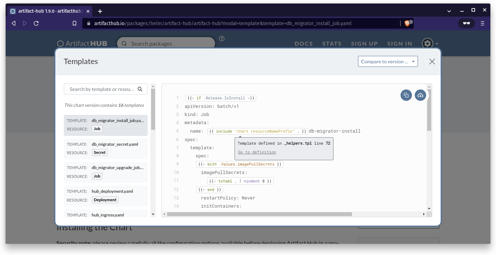

Helm provides the ability to create [named templates](https://helm.sh/docs/chart_template_guide/named_templates/) in charts. You can use a named template one or more times and even pass argumnets to them. Named templates are a wonderful way to write reusable templates for your charts and the building block for [library charts](https://helm.sh/docs/topics/library_charts/#helm).

Artifact Hub now allows you to navigate the named templates from the template explorer.

<!--more-->

When you mouse over a named template a pop-up will tell you the line and file this template is named in. Clicking the "Go to definition" link will take you right to that file and line where you can view this template. If you want to go back to your previous spot you can use your browsers back button to navigate back there.

If you want to try using this feature you can start with [the Artifact Hub chart](https://artifacthub.io/packages/helm/artifact-hub/artifact-hub).
