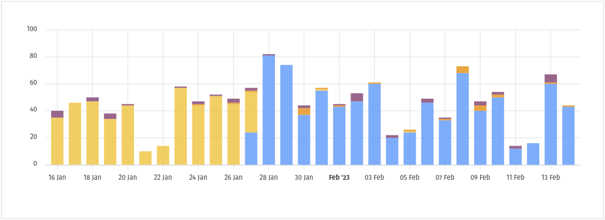
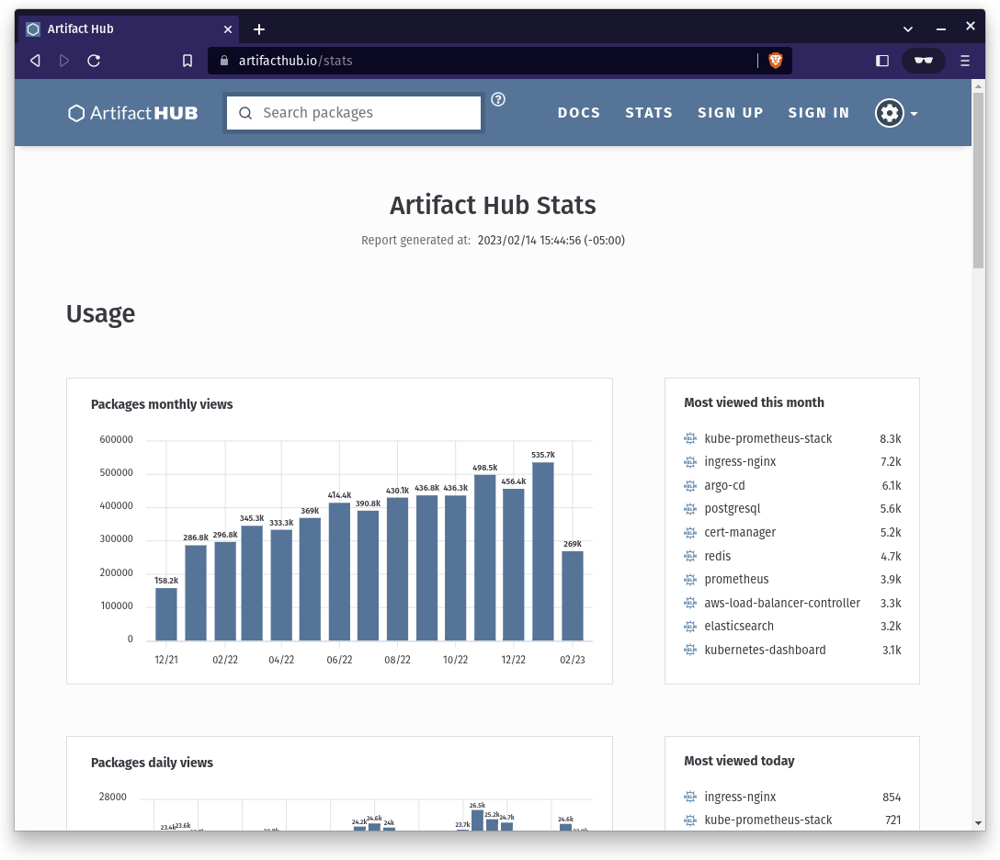

Have you ever wondered how often an artifact is viewed on Artifact Hub? It's possible to view these details right on the page for an artifact. The following image captures 30 days work of statistics for the [Artifact Hub chart](https://artifacthub.io/packages/helm/artifact-hub/artifact-hub).

<!--more-->

The previous 30 days statistics are displayed at the bottom of the page. After the documentation for the artifact.

The different colors showcase different versions of an artifact. For example, when the primary color changed from yellow to blue in the image above it was due to a new latest release.

In addition to the statistics on the individual artifacts, there is an [overall statistics page](https://artifacthub.io/stats). This page provides insight into the most popular packages, number of packages, number of releases, number of repositories being tracked, and so much more. It's a wealth of information showcasing the artifact ecosystem.

