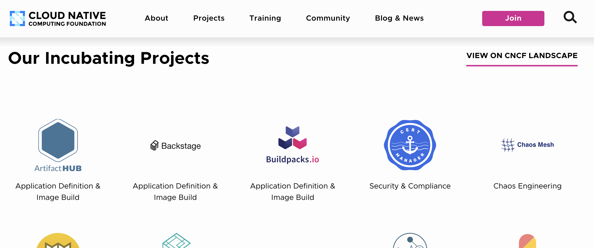

About 5 years ago, at CloudNativeCon + KubeCon North American '19 in San Diego, the idea for Artifact Hub began. At the time there were a few cloud native artifacts and they were discovered via general search or individual targeted sites like the now defunct Helm Hub. In 2020 the development on Artifact Hub began and it eventually moved to a point where we filed for Incubation.

We are happy to announce that Artifact Hub is now a CNCF Incubating Project.

<!--more-->

Some changes since Artifact Hub first launched include:

* Support for more than 20 types of artifacts
* Security scans where container images can be detected
* Related artifacts are highlighted
* You can learn if something is from an official or verified source
* Navigate Helm values files
* Much much more...

Project stats include:

* 1.6k GitHub Stars 
* 1.8k pull requests (excluding dependabot ones)
* 818 issues
* 41 contributors
* 41 Releases
* 15k packages and 285k releases
* 4.1k repositories (the source of the packages published on Artifact Hub)
* 2.5k registered organizations and 31k users
* Monthly packages views keep growing, reaching ~700k at the moment

Thanks to everyone who has contributed to Artifact Hub and who is using it. You're the ones who have made this possible.