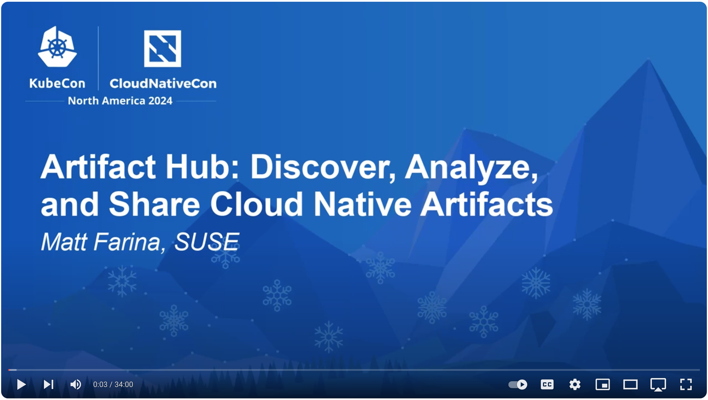

At KubeCon/CloudNativeCon 2024 in North America we presented an overview of Artifact Hub. It covered discovering artifacts, analyzing them, and sharing them. The video from this presentation is online and available [here](https://www.youtube.com/watch?v=027rAkswODw).